# Wordle
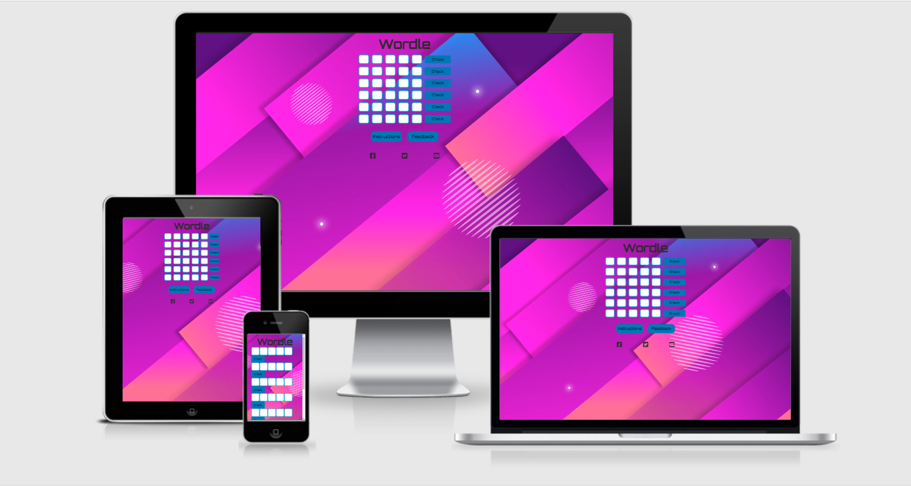

Wordle is a web-based word game created and developed by Welsh software engineer Josh Wardle, and owned and published by The New York Times Company since 2022.Players have to guess a five-letter word, with feedback given for each guess in the form of colored tiles indicating when letters match or occupy the correct position.

Visit the website [here](https://pavithra-veeramani.github.io/Wordle/)

## Table of Contents

1. [User Experience (UX)](#user-experience-UX)
    1. [Project Goals](#project-goals)
    2. [User Stories](#user-stories)
    3. [Color Scheme](#color-scheme)
    4. [Typography](#typography)
    5. [Wireframes](#wireframes)
2. [Features](#features)
    1. [Home Section](#home-section)
    2. [Instructions Section](#instructions-section)
    3. [Feedback Section](#Feedback-section)
3. [Technologies Used](#technologies-used)
    1. [Languages Used](#languages-used)
    2. [Frameworks, Libraries and Programs Used](#frameworks-libraries-and-programs-used)
4. [Testing](#testing)
    1. [Code Validation](#code-validation)
    2. [Accessibility](#accessibility)
    3. [Tools Testing](#tools-testing)
    4. [Manual Testing](#manual-testing)
5. [Finished Product](#finished-product)
6. [Deployment](#deployment)
    1. [GitHub Pages](#github-pages)
7. [Credits](#credits)
    1. [Content](#content)
    2. [Media](#media)
    3. [Code](#code)
8. [Acknowledgements](#acknowledgements)

***

## User Experience (UX)

### Project Goals
* The website is designed considering the expectation of users to be simple and easy to use.

* The user interface is easy to navigate (inlcudes instructions and feedback button.)

* The letters in the game are highlighted with three different colors to solve the puzzle.

* Responsive design for all screen/device sizes like mobile, tablet and desktop.

* A feedback section is provided to get comments from the user.
### User Stories

* As a player, I want the game's website to be understandable and easy to navigate.

* As a player, I want the game to be interestig and engaging.

* As a player, I want hint to guess the correct letter. 

* As a player, I want to be able to play the game on different devices.

### Color Scheme

The colors used in the website are tone 0f blue (#0077B6) as background for the buttons and tone of black (#2B2B2B)
for text color.

### Typography

The primary font used in the game logo is orbitron with sans serif as fallback font.
### Wireframes

[Balsamiq](https://balsamiq.com/) is used to create mockups for the project before any code is written and demonstrating different tools used in the website.

Page | Wireframe
--- | ---
Home section | 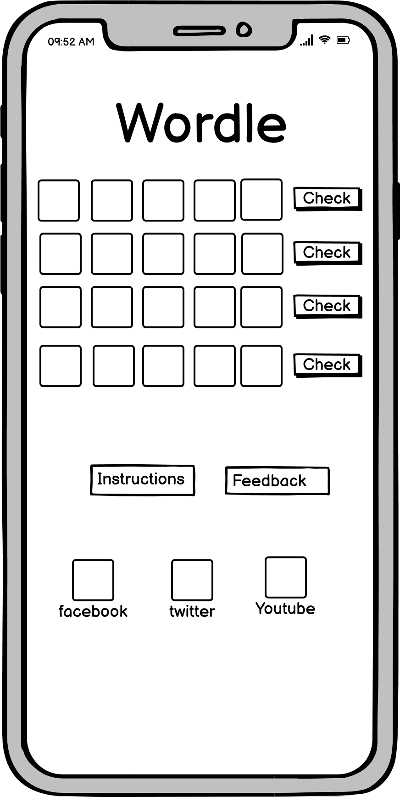 
Instructions section | 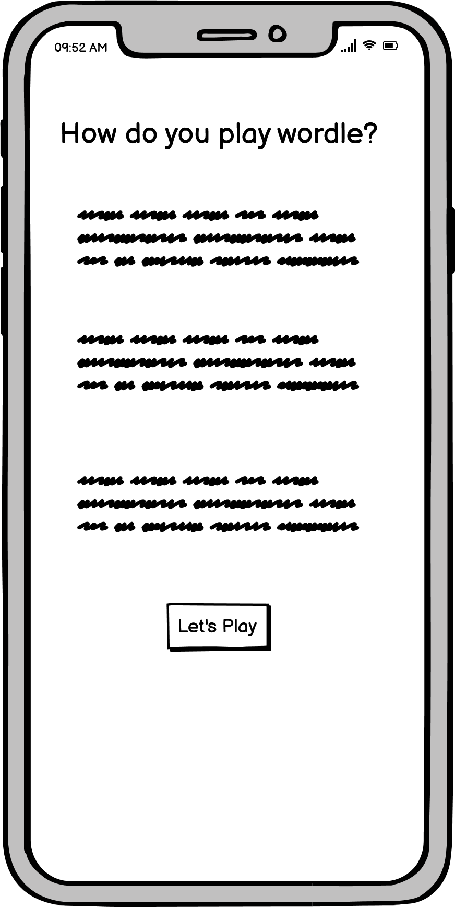
Feedback | 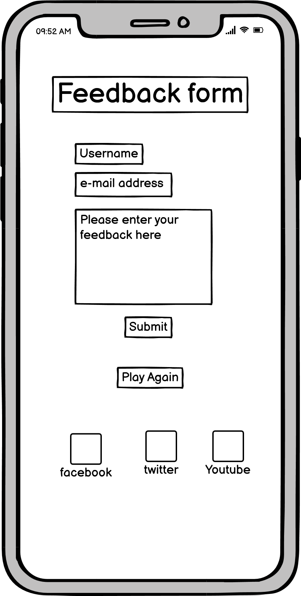

[Back to top ⇧](#Wordle)

## Features
### Home Section
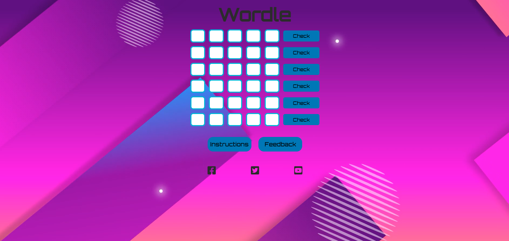 

* **Text Boxes**
- The home section contains text boxes in which the user can enter the letters.

* **Check Buttons**
- The check buttons are used to check if the letters are in the correct place.

* **Instructions Button**
- The instructions button is linked to the game instructions page.

* **Feedback Button**
- The feedback button is linked to the feedback page where the users can enter their comments.

### Instructions Section
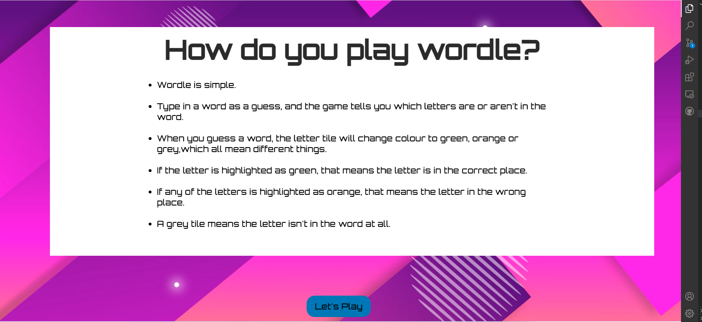 

* The instruction section provides information about how to play the game. 

### Feedback Section
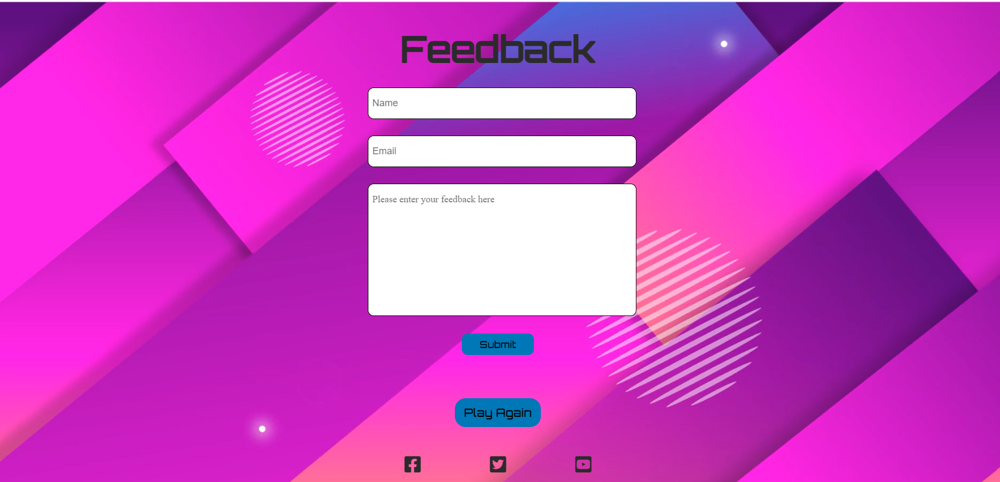 

* The feedback section provides input fields and feedback area where the user can enter their comments.

[Back to top ⇧](#Wordle)

## Technologies Used

### Languages Used
* [HTML5](https://en.wikipedia.org/wiki/HTML5)
* [CSS3](https://en.wikipedia.org/wiki/CSS)
* [Javascript](https://en.wikipedia.org/wiki/JavaScript)

### Frameworks, Libraries and Programs Used

* [Google Fonts](https://fonts.google.com/)
    -Google Fonts was used import fonts.
* [Font Awesome](https://fontawesome.com/)
    -Font Awesome was used for social media icons.
* [W3C Markup Validator](https://validator.w3.org/)
    - W3C Markup Validator was used to validate the HTML code.
##### index.html

##### instructions.html
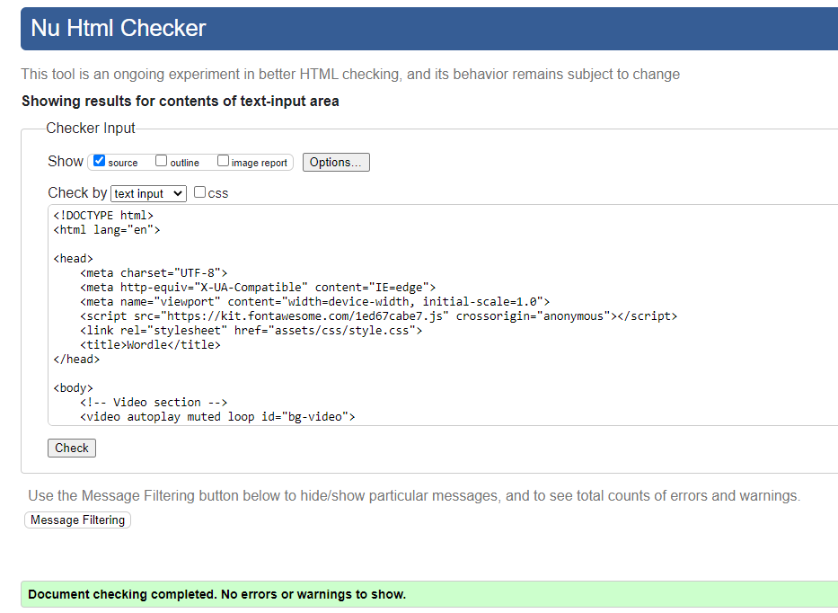

##### feedback.html
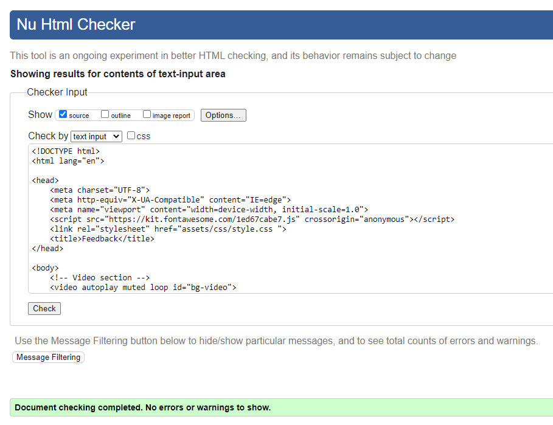
    
* [W3C CSS Validator](https://jigsaw.w3.org/css-validator/)
- W3C CSS Validator was used to validate the CSS code.

  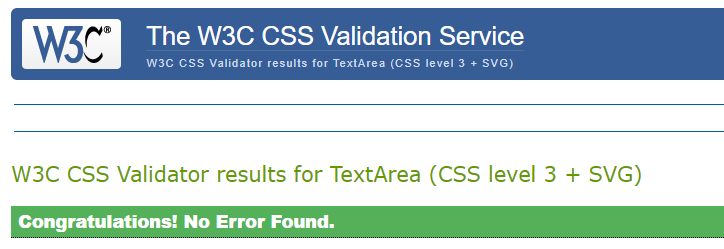
    
    
* [JSHint](https://jshint.com/)
    -JS Hints was used to validate the javascript code.

    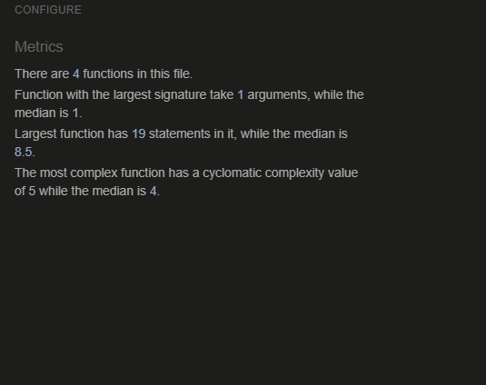

[Back to top ⇧](#Wordle)

## Testing
### Code Validation
* The [W3C Markup Validator](https://validator.w3.org/) and [W3C CSS Validator](https://jigsaw.w3.org/css-validator/) were used to validate all pages of the project in order to ensure there were no syntax errors.
* The [JSHints JavaScript Code Quality Tool](https://jshint.com/) was used to validate JavaScript code.

### Accessibility
* Lighthouse in chrome DevTools are used to check the performance,accessibility and best practices.

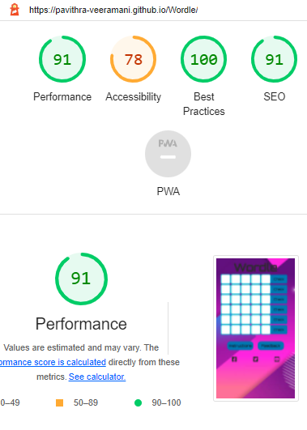

### Tools Testing

 * [Chrome DevTools](https://developer.chrome.com/docs/devtools/)

 - Chrome DevTools was used during the development process to test, explore and modify HTML elements and CSS styles.

 * Responsiveness

    - [Am I Responsive?](http://ami.responsivedesign.is/#) was used to check responsiveness of the site pages across different devices.

     - Chrome DevTools was used to test responsiveness in different screen sizes during the development process.

### Manual Testing

* Browser Compatibility

     Browser | Outcome | Pass/Fail 
     --- | --- | ---
     Google Chrome | No appearance, responsiveness nor functionality issues.| Pass
     Safari | No appearance, responsiveness nor functionality issues. | Pass
     Microsoft Edge | No appearance, responsiveness nor functionality issues. | Pass
     Firefox | No appearance, responsiveness nor functionality issues. | Pass

* Device compatibility

     Device | Outcome | Pass/Fail
    --- | --- | ---
    Laptop | No appearance, responsiveness nor functionality issues. | Pass
    ipad pro | No appearance, responsiveness nor functionality issues. | Pass
    iphone SE | No appearance, responsiveness nor functionality issues. | Pass
    iphone 12 pro | No appearance, responsiveness nor functionality issues. | Pass

* Common Elements Testing

    - General

     Feature | Outcome | Pass/Fail
     --- | --- | ---
    Text box| Cursor automatically moves to the next box. | Pass
    Buttons | Navigating to the required section. | Pass
    Social Links | Open the specific website on a new tab. | Pass
    Wide screen background | Show video background on devices with screen 1024px and up. | Pass
    Landscape Orientation Blocker | Show full screen section when device is turned to landscape orientation. | Pass

   
    [Back to top ⇧](#Wordle)

    ## Deployment

    ### GitHub Pages

        1. Log in to gitHub and click the GitHub repository.

        2. At the top of the repository, find the settings button in the menu.

        3. Scroll down the settings page And find the pages section.

        4. under source, click the none and select Main branch. 

        5. The page will refresh and create alink to the website.

    [Back to top ⇧](#Wordle)

## Credits

### Content

* The instructions for the game were taken from the [Wordle Wiki](https://en.wikipedia.org/wiki/Wordle)

### Media

The background video was taken from  [Pexels](https://www.pexels.com/video/digital-animation-of-geometric-shapes-8675548/) and developed by [Weldi 33 Studio Design](https://www.pexels.com/@weldi-33-studio-design-78158983/)

### Words
The challenge words for the game was taken from the website (https://medium.com/@owenyin/here-lies-wordle-2021-2027-full-answer-list-52017ee99e86)

## Acknowledgements

Thanks to my mentor Marcel Mulders for his support and feedback.

Thanks to the tutor support in code institute for their support.

[Back to top ⇧](#Wordle)

