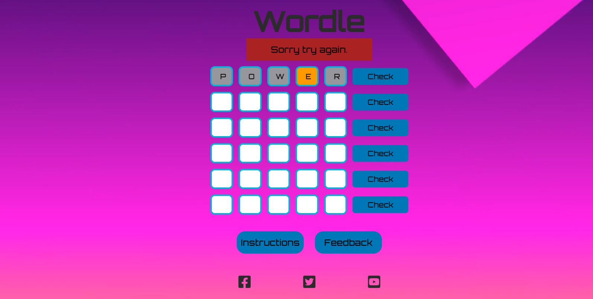

# Wordle

Wordle is a web-based word game created and developed by Welsh software engineer Josh Wardle, and owned and published by The New York Times Company since 2022. Players have to guess a five-letter word, with feedback given for each guess in the form of colored tiles indicating when letters match or occupy the correct position. The game has become so popular that the number of people playing this game is increasing day by day.

I attemped to create my own version of Wordle by maintaining a fixed set of words and randomly picking one for each game. The user has six attempts to guess the word. The app follows the same colors such as Green, Orange and Grey from the original Wordle game.

Visit the website [here](https://pavithra-veeramani.github.io/Wordle/)

## Table of Contents

1. [User Experience (UX)](#user-experience-UX)
    1. [Project Goals](#project-goals)
    2. [User Stories](#user-stories)
    3. [Color Scheme](#color-scheme)
    4. [Typography](#typography)
    5. [Wireframes](#wireframes)
2. [Features](#features)
    1. [Home Page](#home-page)
    2. [Instructions Page](#instructions-page)
    3. [Feedback Page](#Feedback-page)
3. [Technologies Used](#technologies-used)
    1. [Languages Used](#languages-used)
    2. [Frameworks, Libraries and Programs Used](#frameworks-libraries-and-programs-used)
4. [Testing](#testing)
    1. [Code Validation](#code-validation)
    2. [Accessibility](#accessibility)
    3. [Tools Testing](#tools-testing)
    4. [Manual Testing](#manual-testing)
5. [Deployment](#deployment)
    1. [GitHub Pages](#github-pages)
6. [Credits](#credits)
    1. [Content](#content)
    2. [Media](#media)
    3. [Code](#code)
7. [Acknowledgements](#acknowledgements)

***

## User Experience (UX)

### Project Goals
* The website is designed considering the expectation of users to be simple and easy to use.

* The user interface is easy to navigate (inlcudes instructions and feedback button.)

* The letters in the game are highlighted with three different colors to show the outcome.

* Responsive design for all screen/device sizes like Mobile, Tablet, Laptop and Desktop.

* A feedback page is provided to get comments from the user.

### User Stories

* As a player, I want the game's website to be understandable and easy to navigate.

* As a player, I want the game to be interestig and engaging.

* As a player, I want hint to guess the correct word.

* As a player, I want to see the result of the game.

* As a player, I want to be able to play the game on different devices.

### Color Scheme

The colors used in the website are tone 0f blue (#0077B6) as background for the buttons and tone of black (#2B2B2B)
for text color. The colors used for the game success message is rgb(115, 200, 30) and for the failure message is  rgb(174, 25, 25) 

### Typography

The primary font used in the game logo is orbitron with sans serif as fallback font.
### Wireframes

[Balsamiq](https://balsamiq.com/) is used to create mockups for the project before any code is written and demonstrating different tools used in the website.

Page | Wireframe
--- | ---
Home section |  
Instructions section | 
Feedback | 

[Back to top ⇧](#Wordle)

## Features
### Home Page
 

* **Text Boxes**
    
The home section contains text boxes in which the user can enter the letters.

* **Check Buttons**
    
The check buttons are used to check whether the user guesed the correct word.

* **Messages**
    
If the user guessed the correct letter then a success message is shown whereas an error message is shown if the user didn't guess the correct word

    
    

* **Instructions Button**
    
The instructions button is linked to the game instructions page.

* **Feedback Button**
    
The feedback button is linked to the feedback page where the users can enter their comments.

### Instructions Page
 

The instruction section provides information about how to play the game. This includes hints and tips etc.

In the HTML an Unordered list is used to list down all the instructions wrapped inside a div container.

### Feedback Page
 

The feedback section provides input fields and feedback area where the user can enter their comments.

The user can enter their name, email and a comment and submit using a Submit button. The form is posted to https://formdump.codeinstitute.net 

[Back to top ⇧](#Wordle)

## Technologies Used

### Languages Used
* [HTML5](https://en.wikipedia.org/wiki/HTML5)
* [CSS3](https://en.wikipedia.org/wiki/CSS)
* [Javascript](https://en.wikipedia.org/wiki/JavaScript)

### Frameworks, Libraries and Programs Used

* [Google Fonts](https://fonts.google.com/)
    -Google Fonts was used import fonts.
* [Font Awesome](https://fontawesome.com/)
    -Font Awesome was used for social media icons.

## Testing
### Validation
* [W3C Markup Validator](https://validator.w3.org/)
    
W3C Markup Validator was used to validate all the HTML files.

#### index.html

#### instructions.html

#### feedback.html

    
* [W3C CSS Validator](https://jigsaw.w3.org/css-validator/)
    
W3C CSS Validator was used to validate the CSS code.

#### style.css

    
    
* [JSHint](https://jshint.com/)
    
JS Hints was used to validate the javascript code.

#### words.js, common.js and script.js

[Back to top ⇧](#Wordle)

### Accessibility
* Lighthouse in Google Chrome's DevTools is used to check the performance, accessibility and best practices.

### Tools Testing

 * [Chrome DevTools](https://developer.chrome.com/docs/devtools/)
    
Chrome DevTools was used during the development process to test, debug, explore and modify HTML elements and CSS styles on the fly. 

 * Responsiveness
    
[Am I Responsive?](http://ami.responsivedesign.is/#) was used to check responsiveness of the site pages across different devices.

    
Chrome DevTools was used to test responsiveness in different screen sizes during the development process.

### Manual Testing

* Browser Compatibility

     Browser | Outcome | Pass/Fail 
     --- | --- | ---
     Google Chrome | No appearance, responsiveness nor functionality issues.| Pass
     Safari | No appearance, responsiveness nor functionality issues. | Pass
     Microsoft Edge | No appearance, responsiveness nor functionality issues. | Pass
     Firefox | No appearance, responsiveness nor functionality issues. | Pass

* Device compatibility

     Device | Outcome | Pass/Fail
    --- | --- | ---
    Laptop | No appearance, responsiveness nor functionality issues. | Pass
    ipad pro | No appearance, responsiveness nor functionality issues. | Pass
    iphone SE | No appearance, responsiveness nor functionality issues. | Pass
    iphone 12 pro | No appearance, responsiveness nor functionality issues. | Pass

* Common Elements Testing

     Feature | Outcome | Pass/Fail
     --- | --- | ---
    Text box| Cursor automatically moves to the next box after keying in a letter. | Pass
    Feedback button | Successfully navigates to Feedback page. | Pass
    Instructions button | Successfully navigates to Instructions page. | Pass
    Check button | Shows Green color for an exact match for a letter. | Pass
    Check button | Shows Orange color for a match for a letter. | Pass
    Check button | Shows Grey color for an unmatched letter. | Pass
    Success message | Shows 'Congratulations!!' message with a green style | Pass
    Failure message | Shows 'Please try again.' message with a red style | Pass 
    Play again button | Successfully navigates to the Home page. | Pass
    Feedback Form | Successfully submits a form on click of Submit button | Pass
    Social Links | Open the specific website on a new tab. | Pass
    Wide screen background | Show video background on devices with screen 1024px and up. | Pass
    Landscape Orientation Blocker | Show full screen section when device is turned to landscape orientation. | Pass

* Known bugs
  Page | Bug 
     --- | --- 
    Feedback page | The Submit button's style is not properly displayed in iPad Pro
    Home page | The letter text box is accepting all the characters as of now. This needs to be restricted to accept only alphabets.
   
    [Back to top ⇧](#Wordle)

    ## Deployment

    ### GitHub Pages

    * Log in to gitHub and click the GitHub repository.
    * At the top of the repository, find the settings button in the menu.
    * Scroll down the settings page And find the pages section.
    * Under source, click the none and select the Main branch. 
    * The page will refresh and create a link to the website.

    [Back to top ⇧](#Wordle)

## Credits

### Content

The introduction part of this readme was taken from the [Wordle Wiki](https://en.wikipedia.org/wiki/Wordle)

### Media

The background video was taken from  [Pexels](https://www.pexels.com/video/digital-animation-of-geometric-shapes-8675548/) and developed by [Weldi 33 Studio Design](https://www.pexels.com/@weldi-33-studio-design-78158983/)

### Words
The challenge words array for the game was populated by taking the words from the website (https://medium.com/@owenyin/here-lies-wordle-2021-2027-full-answer-list-52017ee99e86)

### Code
* A separate js file is maintained to store all the words in an array. A random number is generated each time and a word is picked out randomly uing this number.
* DOM is used to dynamically construct a word line. This is done by finding div elements that have a particular css style and then adding child elements to it.
* Whenever the Check button is clicked a logic is run to decide whether or not the user guessed the correct word.  This is done by comparing the letters from the random word against the letters from the user entered word.
* A div element is maintained to show the result message. A boolean is maintained to capture the outcome of the game. This boolean is then used to decide what message to be shown in the div.
* Whenever the player keys in a letter, the focus moves on to the next element automatically. This is done by handling keyup event for the letter text boxes.
* The text boxes in the mobile app were getting zoomed in automatically when focussed. This was stopped by a viewport setting that was suggested in a thread in https://stackoverflow.com/.  

## Acknowledgements

Thanks to my mentor Marcel Mulders for his support and feedback.

Thanks to the tutor support in code institute for their support.

[Back to top ⇧](#Wordle)

